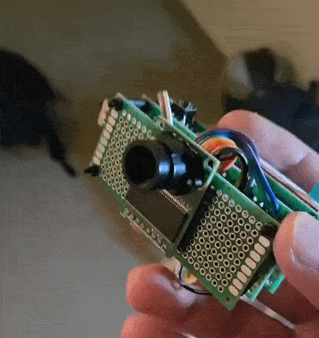
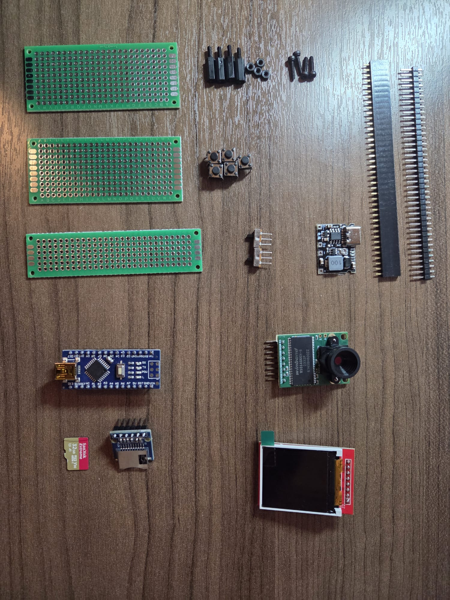
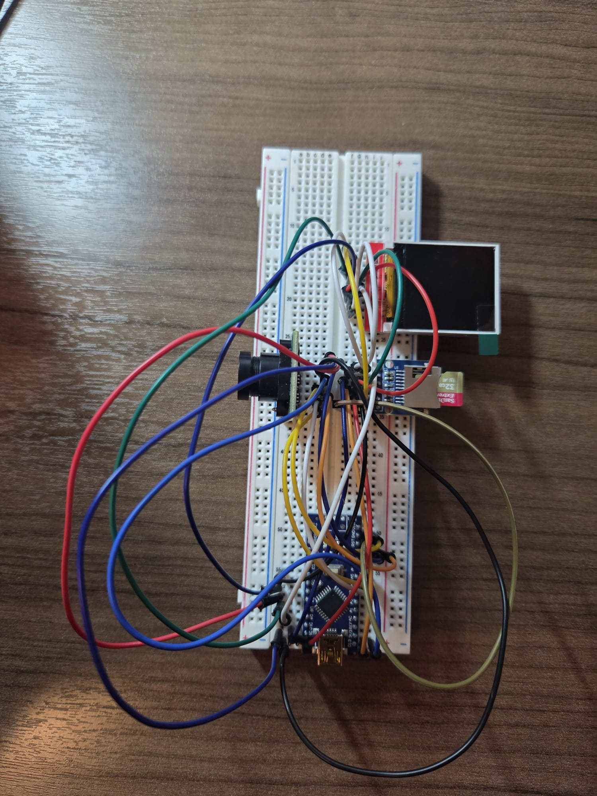
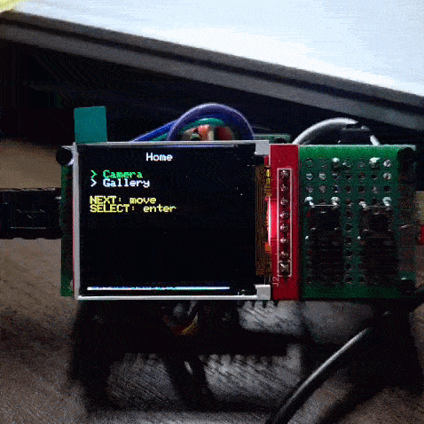

# A Very Crude Camera

Minimal camera system built on an Arduino Nano (ATmega328P) using an ArduCAM OV2640, a 128×128 ST7735 TFT, and an SPI microSD card.

The objective was to implement a complete capture, display, and storage pipeline on an 8-bit AVR under strict memory and bandwidth constraints.

  
   
  <em>System running with TEST_ALL flag enabled</em>

## Overview

Features:

- Live RGB565 preview from OV2640 to TFT  
- JPEG capture and SD storage  
- UI state machine (Home, Camera, Gallery)  
- Shared SPI bus with explicit chip-select arbitration  
- Powered from 1S LiPo via TP4056 and boost converter (5V rail)

All SPI peripherals share MOSI, MISO, and SCK. Device isolation is handled strictly through chip-select control and SPI transaction scoping.

## Hardware

  

- Arduino Nano (ATmega328P, 16 MHz, 2 KB SRAM)
- ArduCAM Mini 2MP (OV2640)
- ST7735 128×128 TFT
- SPI microSD module
- Push buttons (INPUT_PULLUP)
- TP4056 LiPo charger with boost converter

  

## Wiring

  

### Shared SPI Bus

Signal | Nano Pin | Connected Devices
--- | --- | ---
MOSI | D11 | ArduCAM, TFT, SD
MISO | D12 | ArduCAM, SD
SCK  | D13 | ArduCAM, TFT, SD

### ArduCAM (OV2640)

Signal | Nano Pin
--- | ---
CS   | D7
MOSI | D11
MISO | D12
SCK  | D13
VCC  | 5V
GND  | GND

### ST7735 TFT (128×128)

Signal | Nano Pin
--- | ---
CS   | D8
DC   | D9
RST  | D6
MOSI | D11
SCK  | D13
VCC  | 5V
GND  | GND

### SD Card Module

Signal | Nano Pin
--- | ---
CS   | D4
MOSI | D11
MISO | D12
SCK  | D13
VCC  | 5V
GND  | GND

### Buttons

Signal | Configuration
--- | ---
NEXT   | GPIO, INPUT_PULLUP
SELECT | GPIO, INPUT_PULLUP
CLICK  | GPIO, INPUT_PULLUP

Only one CS line is asserted at any time. All SPI accesses are wrapped in SPI.beginTransaction and SPI.endTransaction blocks.

## Software Architecture

The firmware is structured as a state-driven application. Each module isolates one subsystem.

  
   
  <em>quick UI mockup</em>

### Camera.cpp

Responsible for:

- OV2640 initialization and mode switching (BMP and JPEG)
- Capture trigger and timeout handling
- FIFO length validation
- Burst read from ArduCAM FIFO
- JPEG stream extraction with SOI and EOI detection
- RGB565 preview frame acquisition

Preview frames are captured at 160×120 and center-cropped to 128×120 for display. No scaling is performed.

### Storage.cpp

Implements:

- SD initialization and reinitialization
- Sequential filename generation (IMG000.JPG, IMG001.JPG, ...)
- Chunked JPEG write from FIFO stream
- File existence checks for gallery listing

All SD writes are performed under dedicated SPI transactions.

### Ui.cpp

Handles:

- TFT initialization
- View rendering (Home, Camera, Gallery)
- Overlay drawing
- Selection highlighting
- Minimal redraw logic to reduce flicker

Rendering avoids dynamic allocation and limits per-frame overhead.

### Buttons.cpp

Provides:

- Edge-triggered press detection
- Debouncing
- Logical input abstraction

All buttons are active-low using internal pull-ups.

### SpiBus.cpp

Centralizes SPI arbitration:

- Device preparation routines
- Chip-select management
- Transaction boundary enforcement

Prevents undefined behavior from simultaneous SPI device access.

### Main.cpp

Implements:

- Application state machine
- View transitions
- Capture workflow
- Gallery navigation
- Conditional test mode execution

No dynamic memory allocation is used anywhere in the application.

## Build Flags

### DEBUG

Enables serial diagnostics including JPEG byte count, SOI and EOI status, and SPI probe results.  
Disable for release builds to reduce flash usage.

### TEST_ALL

Automatically cycles through Home, Camera, and Gallery views.  
Used for display validation without manual input.  
Disable for normal interactive operation.

## Constraints

- 32 KB flash
- 2 KB SRAM
- Shared SPI bandwidth
- Blocking SD writes during capture

Performance is primarily limited by SPI clock speed and transaction switching overhead.

## Future Work

- [] Migrate to RP2040 or ESP32 for higher throughput
- [] Increase CAM SPI clock if stable
- [] Add JPEG compression control via sensor registers
- [] Implement image viewer in gallery
- [] Design enclosure
- [] Improve preview FPS using continuous FIFO burst reads
